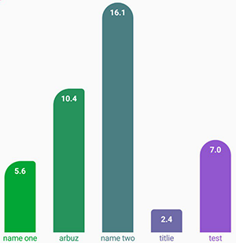

# MaterialPlotView
!!!!EARLY VERSION!!!!
!!!!WORK IN PROGRESS!!!!

Annotation-based observable plots and diagrams.

## 1. Install.


Add it in your root build.gradle at the end of repositories:
```
allprojects {
    repositories {
        ...
        maven { url 'https://jitpack.io' }
    }
}
```
Step 2. Add the dependency
```
dependencies {
    implementation 'com.github.Pomis:MaterialPlotView:-SNAPSHOT'
}
```

## 2. Use

#### BarPlotView



Create XML
```
<pomis.app.materailplotview.Views.BarPlotView
    android:id="@+id/bpv"
    android:layout_width="match_parent"
    android:layout_height="match_parent"
    app:bar_style="irregularly_rounded"
    app:bar_width="48dp"
    app:font_size="12dp"
    app:gradient_end_color="@color/colorEnd"
    app:gradient_start_color="@color/colorStart" />
```

Annotate your model
```
public class ExampleModel {
    @BarName
    String name;

    @BarHeight
    float height;

    ...
}

```

Bind list
```
List<ExampleModel> testList = new ArrayList<>();
testList.add(new ExampleModel("name one", 10f, 34f));
testList.add(new ExampleModel("arbuz", 10f, 55f));
testList.add(new ExampleModel("name two", 16f, 21f));
barPlotView.source(testList);
```

If you want plot to automatically update when list changes use `observe` method

```
ObserbaleList<ExampleModel> testList = new ObserbaleArrayList<>();
testList.add(new ExampleModel("name one", 10f, 34f));
testList.add(new ExampleModel("arbuz", 10f, 55f));
testList.add(new ExampleModel("name two", 16f, 21f));
barPlotView.observe(testList);

```

#### LineChartView


Create XML
```
<pomis.app.materailplotview.Views.LineChartView
    android:id="@+id/lcv"
    android:layout_width="match_parent"
    android:layout_height="100dp" />
```

Annotate your model
```
public class GraphModel {
    @LineX
    int x;

    @LineY
    int y;

    ...
}

```

Bind list
```
ArrayList<GraphModel> models = new ArrayList<>();
models.add(new GraphModel(12, 15));
models.add(new GraphModel(15, 35));
models.add(new GraphModel(16, 66));
models.add(new GraphModel(18, 78));
models.add(new GraphModel(19, 81));
models.add(new GraphModel(22, 98));
models.add(new GraphModel(23, 66));
models.add(new GraphModel(25, 44));
models.add(new GraphModel(26, 22));
models.add(new GraphModel(27, 53));
lcv.source(models);
```